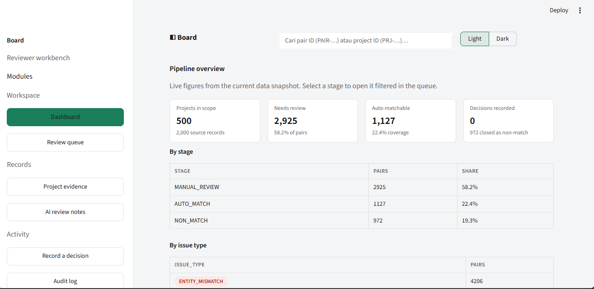
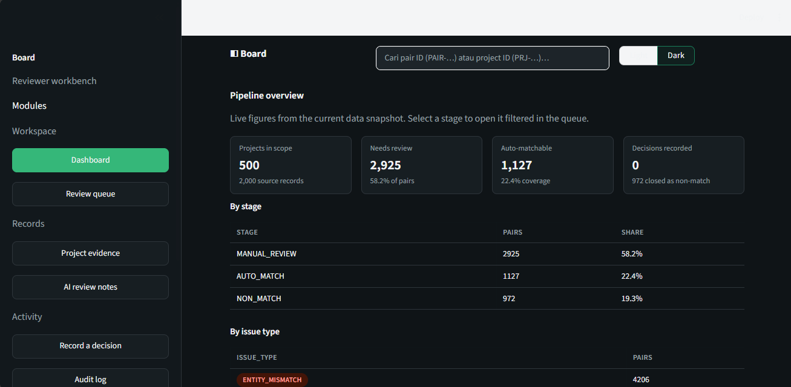

# Board — Solar Data Review & AI/ML Reconciliation Platform


> **Trained and evaluated on real public internet datasets — no mock data.**
> Entity resolution, anomaly detection, and AI-assisted review over messy,
> real-world records, wrapped in a CRM-style reviewer workbench with Light/Dark mode.

*Ringkasan: platform review data proyek solar multi-sumber — entity resolution,
deteksi anomali, dan review berbantuan AI — dilatih dan dievaluasi murni
dengan dataset publik asli dari internet, plus aplikasi review gaya CRM.*




---

## 1. What problem does this solve?

Operations teams receive the **same project** reported differently by the CRM,
the ERP, partners, and signed documents. A reviewer must answer three questions:

| # | Question | Output |
|---|----------|--------|
| A | Do two records from independent sources refer to the same real project? | `MATCH` / `NON_MATCH` / `REVIEW` + `match_probability` |
| B | Is a record/measurement unusual vs. historical behavior? | `NORMAL` / `ANOMALY` + `anomaly_score` |
| C | Which cases auto-pass and which need a human? | `AUTO_MATCH` / `MANUAL_REVIEW` / `NON_MATCH` / `HIGH_RISK` |

*Ringkasan: menjawab tiga pertanyaan reviewer — apakah dua record itu entitas
yang sama, apakah ada anomali, dan kasus mana yang boleh otomatis vs. harus
diperiksa manusia.*

---

## 2. Real public internet datasets (with links)

No mock data. Every model below is trained/evaluated on these public sources
(raw files stay local per license — see `data/README.md`; redistribution terms
respected, nothing restricted is committed):

| Dataset | Link | License | Role in this project |
|---|---|---|---|
| Solar Power Generation | https://www.kaggle.com/anikannal/solar-power-generation-data | Kaggle terms (verify before reuse) | Time-series anomaly detection, 139,917 rows, 2 plants, 15-min intervals |
| FEBRL4 | https://recordlinkage.readthedocs.io/en/latest/ref-datasets.html | Public domain | Entity-linkage benchmark, 2×5,000 records, known true links |
| NAB (Numenta Anomaly Benchmark) | https://github.com/numenta/NAB | MIT | **Labeled** real-world anomalies (server metrics, machine sensors, NYC taxi) |
| DeepMatcher dirty sets | https://github.com/icip-cas/EntityMatcher | Research use | Real messy product/citation pairs, clean-vs-dirty comparison |
| Hospital + Flights | https://github.com/HoloClean/holoclean | Apache-2.0 | Dirty-table cleaning story + cross-source conflicts |
| UCI Donation (Record Linkage) | https://archive.ics.uci.edu/dataset/210/record-linkage-comparison-patterns | CC BY 4.0 | Large-scale ER training data (5.7M pairs, 20,931 matches) |
| Epoch 2026 | https://www.kaggle.com/competitions/epoch-2026/data | MIT | Attempted — competition ended, API returns 403; documented honestly |

The only synthetic part is the **canonical master + CRM/ERP/partner exports**
(generated by notebook 03, fully logged) — used because public solar data has
no customer/installer fields. This is declared everywhere, never hidden.

*Ringkasan: semua model dilatih dari data publik asli bertautan di atas.
Satu-satunya data buatan adalah master kanonis + simulasi sumber enterprise
yang didokumentasikan terbuka.*

---

## 3. How the program works

```
FILE SOURCES (CSV/XLSX) → INGESTION → VALIDATION → PostgreSQL
                                                     ↓
              ┌──────────── DATA QUALITY ←── AI / ML models ────┐
              ↓                                                 ↓
        REVIEW QUEUE (Board app) ──→ HUMAN REVIEW ──→ AUDIT LOG ──→ FEEDBACK
```

1. **Ingest** (`src/ingestion/`): file adapters convert each source export to
   one canonical schema, preserving provenance (`source_system`,
   `ingestion_run_id`, `raw_file_reference`).
2. **Validate** (notebook 02 + `hospital_constraints.txt`): required fields,
   ranges, uniqueness, denial constraints, cross-source consistency.
3. **Match** (notebooks 05–06): deterministic baseline → blocking →
   pairwise similarity features → supervised classifiers → calibrated routing.
4. **Detect** (notebook 07): statistical baselines + Isolation Forest / LOF,
   scored against **hand-labeled** NAB windows.
5. **Explain** (notebook 08): rule-based reviewer notes — discrepancy class,
   evidence table, clarification draft. Never overwrites source data.
6. **Decide** (Board app): reviewer approves/rejects/requests clarification;
   every decision needs a reason and lands in the audit log with model version.
7. **Trace** (`sql/schema.sql`, 12 tables): every prediction and decision
   carries model version + timestamp, fully reconstructable.

*Ringkasan: file sumber → validasi → matching ML → deteksi anomali →
penjelasan AI → keputusan manusia → audit log. Semua bisa dilacak ulang.*

---

## 4. Machine learning (real models, real metrics)

**Entity resolution — features:** Jaro-Winkler customer/installer/address
similarity, **TF-IDF cosine** on product titles, city/state match, capacity
difference, status match. Split at **entity level** (no leakage), thresholds
calibrated on validation, single source in `config/models.yaml`
(`auto_match ≥ 0.90`, review below `0.30`).

| Training data | Model | Precision | Recall | F1 | ROC-AUC |
|---|---|---|---|---|---|
| Synthetic pairs (5,024) | Logistic Regression | 0.728 | 1.000 | 0.843 | 0.833 |
| Synthetic pairs (5,024) | Random Forest | 0.737 | 1.000 | 0.849 | 0.842 |
| Dirty Walmart-Amazon | Logistic Regression | 0.769 | 0.052 | 0.097 | 0.776 |
| Clean Walmart-Amazon | Logistic Regression | 0.595 | 0.244 | 0.346 | 0.800 |
| Dirty Walmart-Amazon | Random Forest | 0.242 | 0.207 | 0.223 | 0.680 |

Honest reading: dirt destroys recall — exactly why the review queue exists
instead of forced auto-decisions. Ground truth: 2,982 positives / 2,042
negatives (incl. 58 hard negatives), leakage checks 0 violations.

**Anomaly detection — NAB labeled series (point-level vs. hand labels):**

| Series | Labeled anomalies | Rolling MAD F1 | Isolation Forest F1 |
|---|---|---|---|
| machine_temp | 2,268 | 0.062 | **0.508** |
| nyc_taxi | 1,035 | 0.000 | 0.146 |
| ec2_cpu | 402 | 0.031 | 0.132 |
| grok_asg | 465 | 0.234 | 0.107 |

Real labeled anomalies are hard — statistical baselines mostly fail, Isolation
Forest is steadier. On solar data: percentile 688 / rolling MAD 1,399 /
Isolation Forest 3,436 flags; injected-anomaly recovery 100% (50/50).

**AI reviewer:** deterministic explainer (8 discrepancy classes:
`ENTITY_MISMATCH`, `NUMERIC_CONFLICT`, `STATUS_CONFLICT`,
`FORMATTING_DIFFERENCE`, `POTENTIAL_DUPLICATE`, `DOCUMENT_MISMATCH`,
`MISSING_DATA`, `OTHER`) + evidence table + neutral clarification draft.

*Ringkasan ML: fitur similarity + TF-IDF, model LR/RF/Isolation Forest,
dievaluasi dengan metrik asli di atas — termasuk hasil yang jelek (NAB),
karena anomali berlabel dunia nyata memang sulit. Threshold tunggal di
`config/models.yaml`.*

---

## 5. The Board app (CRM-style reviewer workbench)

`streamlit run app/dashboard.py` → `localhost:8501` (or `run_app.bat`).
Light/Dark toggle, guaranteed text contrast in both modes.

- **Dashboard** — pipeline overview, queue by stage/issue, records per source
- **Review queue** — saved views (Needs review / High risk / Auto-matchable),
  filters, sorting, CSV export; ground-truth labels hidden by design
- **Project evidence** — canonical facts + side-by-side CRM/ERP/Partner/Document
  comparison + related pairs
- **AI review notes** — classification chip, field-evidence table, P(match),
  clarification draft, uncertainty statement
- **Record a decision** — MATCH / NON_MATCH / CLARIFICATION, reason required
- **Audit log** — every decision with reviewer, reason, model version, timestamp
- **Model performance** — persisted NAB + dirty-ER tables + limitations

*Ringkasan: aplikasi review gaya CRM dengan 7 layar, mode terang/gelap,
antrean review tersimpan, bukti per sumber berdampingan, dan audit log.*

---

## 6. Reproduce it

```bash
pip install -r requirements.txt
python -m unittest discover -s tests -v        # 51 tests
streamlit run app/dashboard.py                 # Board workbench
```

Notebooks `01`–`10` (+ `00_colab_setup` helper) run end-to-end; full Colab
guide (easy / medium / hard) in `docs/COLAB_RUNNING_GUIDE.md`.
Raw datasets are git-ignored (158 MB) — download instructions in
`data/README.md` + `reports/data_lineage.md`.

*Ringkasan: install → 51 tests hijau → jalankan notebook 01–10 → buka Board.
Panduan Colab 3 level tersedia.*

---

## 7. Limitations (stated upfront)

- Canonical master + enterprise exports are synthetic (documented generator).
- Solar data has no customer/installer fields; FEBRL4 is synthetic.
- Epoch 2026 unavailable (competition ended).
- NAB scores are modest — reported as-is, not hidden.
- PostgreSQL schema + migration provided; live DB not required for the demo.

*Ringkasan: batas-batas di atas dinyatakan terbuka — tidak ada klaim palsu.*

---

## 8. Repository map

```
notebooks/  00_colab_setup + 01–10 research notebooks
src/        ingestion · preprocessing · matching (+real_data.py) · anomaly · ai
app/        dashboard.py (Board workbench)
sql/        schema.sql (12 tables) · migrate.py
config/     models.yaml (single threshold source)
tests/      51 tests (unit + data + integration + app)
reports/    suitability · dictionary · lineage · evaluations · validation gates
docs/       COLAB_RUNNING_GUIDE.md · screenshots/
data/       raw/ (git-ignored) · processed/ (generated, committed)
```

## License

MIT — see `LICENSE`. Third-party datasets keep their original licenses
(MIT / Apache-2.0 / CC BY 4.0 / Kaggle terms / public domain).
