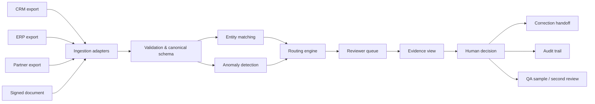
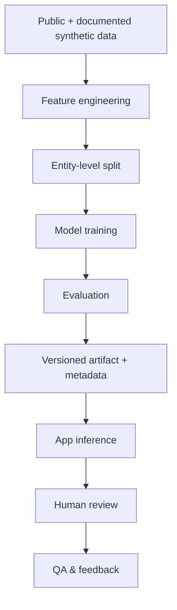

# Architecture

DataReview-ML is structured as a human-in-the-loop data reconciliation system rather than a standalone prediction model.

## System context

## Component boundaries

| Layer | Responsibility | Main location |
|---|---|---|
| Ingestion | Normalize source exports and retain provenance | `src/ingestion/` |
| Preprocessing | Build canonical/master representations | `src/preprocessing/` |
| Matching | Feature generation, entity-resolution model, artifact loading | `src/matching/` |
| Anomaly | Statistical/ML anomaly scoring | `src/anomaly/` |
| Review | Evidence, lifecycle, QA, reviewer metrics | `src/review/` |
| AI/explanation | Reviewer-facing explanations and clarification drafts | `src/ai/` |
| UI | Streamlit reviewer workstation | `app/dashboard.py` |
| Persistence | Demo files + optional PostgreSQL schema | `data/processed/`, `sql/` |

## Design principles

1. **Human decision > model suggestion.** Model scores route work; they do not overwrite source truth.
2. **Evidence before action.** Reviewer decisions are backed by field-level source comparison.
3. **Traceability.** Model version, timestamps, reason codes, and source provenance are preserved.
4. **Reproducibility.** Model artifacts and metadata are versioned; model training is separated from app inference.
5. **Honest evaluation.** Weak benchmark results are reported rather than hidden.

## Runtime modes

### File-based demo
The default portfolio path. Generated processed files are used directly by the Streamlit application.

### Docker Compose
Runs the application plus an optional PostgreSQL service for schema/migration demonstration.

## ML lifecycle

